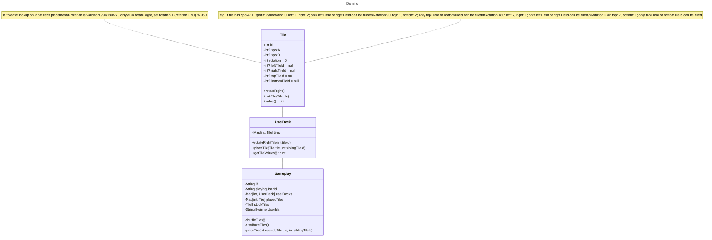

# Domino

## Diagram

### Class Diagram

```mermaid
---
title: Domino
---
classDiagram
    note for Tile "id to ease lookup on table deck placement\n rotation is valid for 0/90/180/270 only\nOn rotateRight, set rotation = (rotation + 90) % 360"
    note for Tile "e.g. if tile has spotA: 1, spotB: 2\nRotation 0: left: 1, right: 2; only leftTileId or rightTileId can be filled\nRotation 90: top: 1, bottom: 2; only topTileId or bottomTileId can be filled\nRotation 180: left: 2, right: 1; only leftTileId or rightTileId can be filled\nRotation 270: top: 2, bottom: 1; only topTileId or bottomTileId can be filled"
    class Tile{
        +int id
        -int? spotA
        -int? spotB
        -int rotation = 0
        -int? leftTileId = null
        -int? rightTileId = null
        -int? topTileId = null
        -int? bottomTileId = null
        +rotateRight()
        +linkTile(Tile tile)
        +value(): int
    }
    class UserDeck{
        -Map[int, Tile] tiles
        +rotateRightTile(int tileId)
        +placeTile(Tile tile, int siblingTileId)
        +getTileValues(): int
    }
    class Gameplay{
        -String id
        -String playingUserId
        -Map[int, UserDeck] userDecks
        -Map[int, Tile] placedTiles
        -Tile[] stockTiles
        -String[] winnerUserIds
        -shuffleTiles()
        -distributeTiles()
        -placeTile(int userId, Tile tile, int siblingTileId)
    }
    Tile -- UserDeck
    UserDeck --  Gameplay
```
