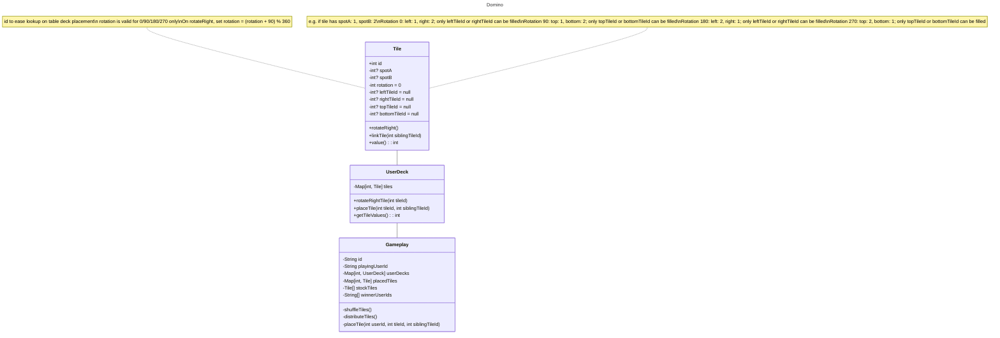
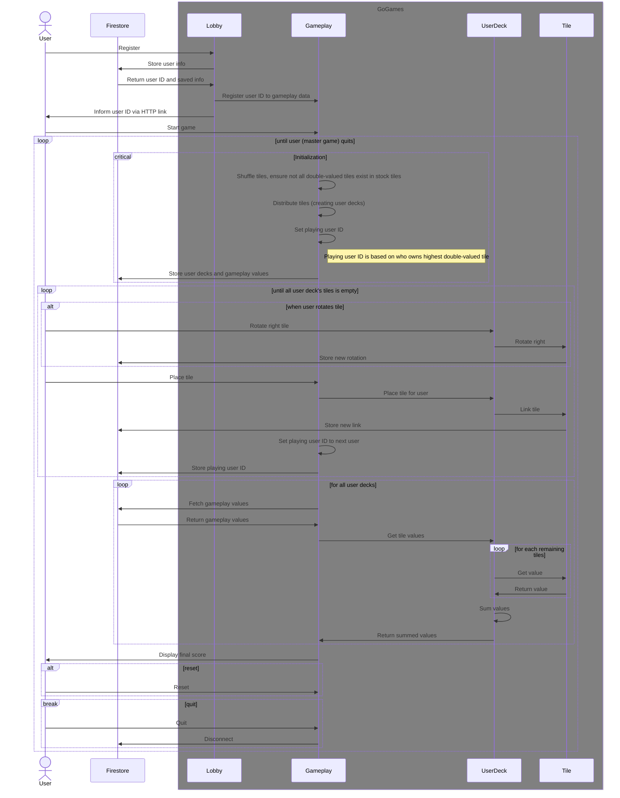

# Domino

## Diagram

### Class Diagram

```mermaid
---
title: Domino
---
classDiagram
    note for Tile "id to ease lookup on table deck placement\n rotation is valid for 0/90/180/270 only\nOn rotateRight, set rotation = (rotation + 90) % 360"
    note for Tile "e.g. if tile has spotA: 1, spotB: 2\nRotation 0: left: 1, right: 2; only leftTileId or rightTileId can be filled\nRotation 90: top: 1, bottom: 2; only topTileId or bottomTileId can be filled\nRotation 180: left: 2, right: 1; only leftTileId or rightTileId can be filled\nRotation 270: top: 2, bottom: 1; only topTileId or bottomTileId can be filled"
    class Tile{
        +int id
        -int? spotA
        -int? spotB
        -int rotation = 0
        -int? leftTileId = null
        -int? rightTileId = null
        -int? topTileId = null
        -int? bottomTileId = null
        +rotateRight()
        +linkTile(int siblingTileId)
        +value(): int
    }
    class UserDeck{
        -Map[int, Tile] tiles
        +rotateRightTile(int tileId)
        +placeTile(int tileId, int siblingTileId)
        +getTileValues(): int
    }
    class Gameplay{
        -String id
        -String playingUserId
        -Map[int, UserDeck] userDecks
        -Map[int, Tile] placedTiles
        -Tile[] stockTiles
        -String[] winnerUserIds
        -shuffleTiles()
        -distributeTiles()
        -placeTile(int userId, int tileId, int siblingTileId)
    }
    Tile -- UserDeck
    UserDeck --  Gameplay
```

### Sequence Diagram

```mermaid
sequenceDiagram
    actor User
    participant Firestore
    box Gray GoGames
        participant Lobby
        participant Gameplay
        participant UserDeck
        participant Tile
    end
    User->>Lobby: Register
    Lobby->>Firestore: Store user info
    Firestore->>Lobby: Return user ID and saved info
    Lobby->>Gameplay: Register user ID to gameplay data
    Lobby->>User: Inform user ID via HTTP link
    User->>Gameplay: Start game
    loop until user (master game) quits
        critical Initialization
        Gameplay->>Gameplay: Shuffle tiles, ensure not all double-valued tiles exist in stock tiles
        Gameplay->>Gameplay: Distribute tiles (creating user decks)
        Gameplay->>Gameplay: Set playing user ID
        Note right of Gameplay: Playing user ID is based on who owns highest double-valued tile
        Gameplay->>Firestore: Store user decks and gameplay values
    end
    loop until all user deck's tiles is empty
        alt when user rotates tile
            User->>UserDeck: Rotate right tile
            UserDeck->>Tile: Rotate right
            Tile->>Firestore: Store new rotation
        end
        User->>Gameplay: Place tile
        Gameplay->>UserDeck: Place tile for user
        UserDeck->>Tile: Link tile
        Tile->>Firestore: Store new link
        Gameplay->>Gameplay: Set playing user ID to next user
        Gameplay->>Firestore: Store playing user ID
    end
    loop for all user decks
        Gameplay->>Firestore: Fetch gameplay values
        Firestore->>Gameplay: Return gameplay values
        Gameplay->>UserDeck: Get tile values
        loop for each remaining tiles
            UserDeck->>Tile: Get value
            Tile->>UserDeck: Return value
        end
        UserDeck->>UserDeck: Sum values
        UserDeck->>Gameplay: Return summed values
    end
    Gameplay->>User: Display final score
    alt reset
        User->>Gameplay: Reset
    end
    break quit
        User->>Gameplay: Quit
        Gameplay->>Firestore: Disconnect
    end
end
```
